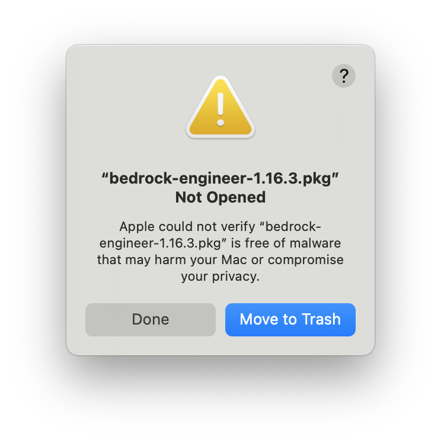
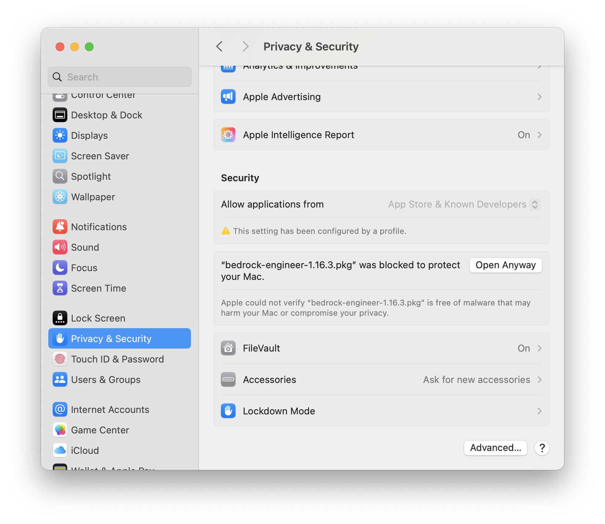
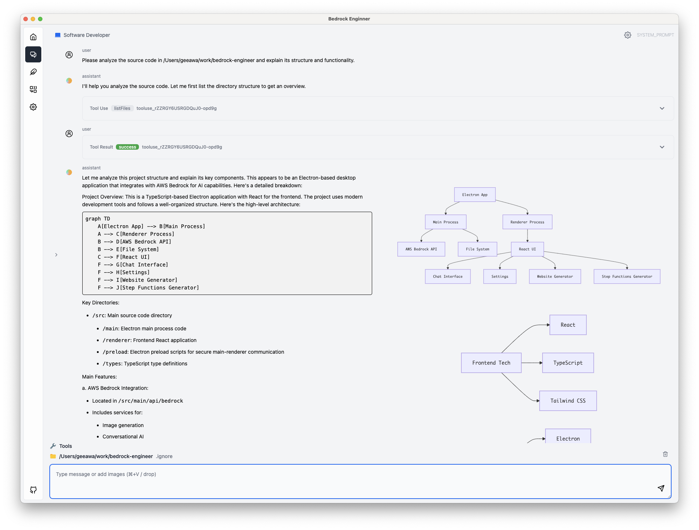
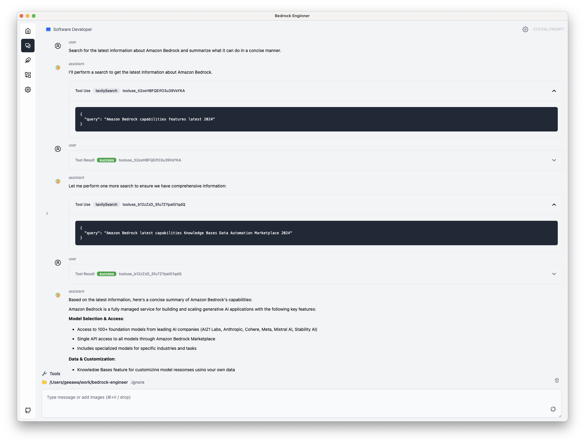
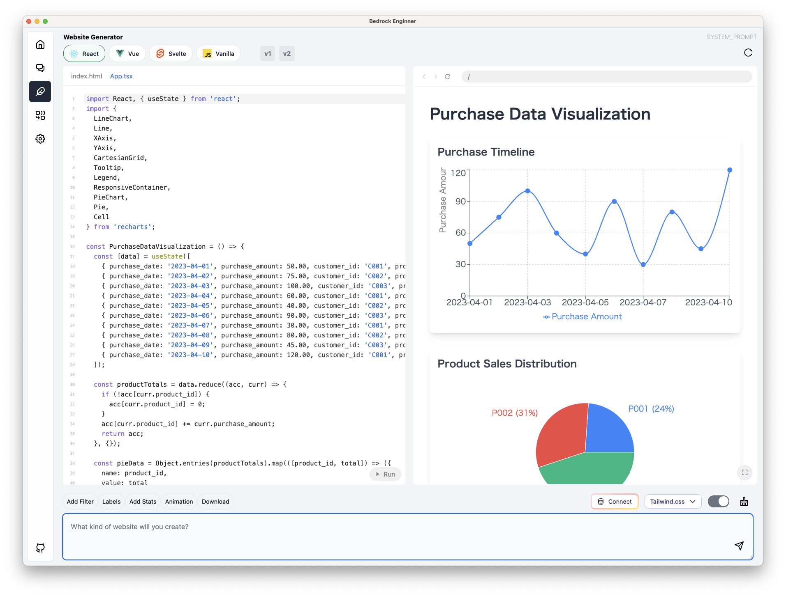
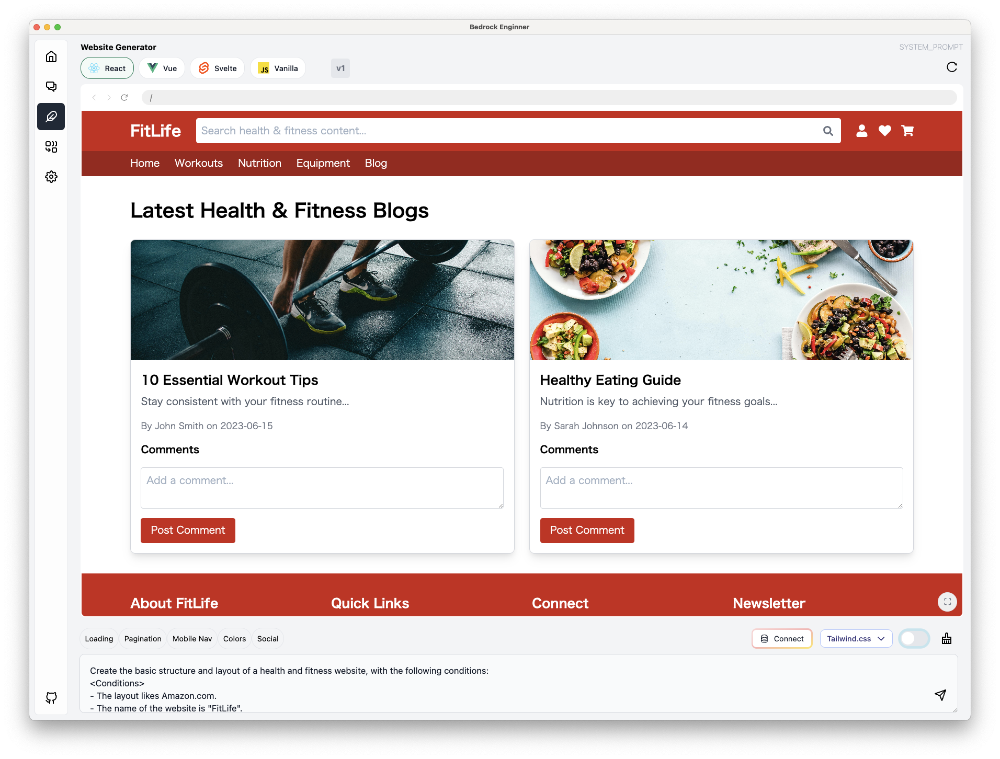

Original Code here: https://github.com/aws-samples/bedrock-engineer

This repository is a fork of the original code with personal updates that deviate from upstream.

Code built from this repo is versioned based on the date of the build rather than the original versioning scheme.
i.e. Version: 2026.629.1 was the second daily build on 2026-06-29.

## What's different in this fork

Everything below the [upstream documentation](#-bedrock-engineer) still applies. This section covers
what this fork adds or changes. The dated changelog lives in [CHANGELOG.md](./CHANGELOG.md), whose
newest dated section is published as the release notes for each build.

**New to the app, or looking for how something works?** The [User Guide](./docs/USER_GUIDE.md) is a
complete, plain-language walkthrough of every screen, every tool and every setting, with a
question index and a troubleshooting section. Agents in the app can read it too, so you can just ask
the chat how a feature works.

**Setting up AWS for the first time?** See
[Setting up access to Amazon Bedrock](./docs/USER_GUIDE.md#4-setting-up-access-to-amazon-bedrock) in
the User Guide. It walks through enabling model access in the Bedrock console, attaching the IAM
policy, creating access keys in the console or with the API, installing the AWS CLI, filling in
`~/.aws/credentials` and `~/.aws/config`, and testing that it all works.

### Help, without leaving the app

A **Help** button sits in the bottom-left corner, just above the GitHub link. It opens a chat called
"Bedrock Engineer Help" with the user guide already attached, so you can ask how something works and
get an answer taken from the guide instead of guessed at. The guide is bundled into the build, so it
always matches the version you are running and works offline.

The help chat runs on whichever model you chose as the **Light Processing Model** in Settings — the
guide is long, and a small model keeps it cheap — falling back to your main conversation model if
that setting is empty. It deliberately has no tools, so it cannot read your files or inspect your
settings; it answers from the guide and says so when the guide does not cover your question. Clicking
Help again continues the same conversation rather than starting a new one.

If you have not set a project directory yet, the guide cannot be saved as a chat attachment. Help
still works — the guide is given to the agent directly, and a note explains why no attachment is
listed.

### My Agents

Agents are created and maintained on a **My Agents** page that opens in the main window, with its
own sidebar button. It replaces the "Custom Agents" overlay that upstream opens on top of the chat.


- Create, edit, duplicate, export and remove agents from one place. Clicking an agent opens its
  editor rather than switching the active agent.
- **Move agents in and out as files.** **Download YAML** in an agent's ⋮ menu writes its
  configuration to a file you pick, stripped of the internal id and the flags recording where your
  copy came from so it is portable. **Import Agent**, beside Add New Agent, reads such a file back in
  as one of _your_ agents — editable, with a fresh id, rather than the read-only kind you get from a
  project's shared folder.
- **Un-share an agent.** Once an agent has been written into a project's
  `.bedrock-engineer/agents/` folder, **Delete Shared File** in its ⋮ menu removes that file after
  confirming the full path. Your own copy is untouched; only the copy everyone opening the project
  sees goes away. Upstream has no way to undo sharing from inside the app.
- **Hide the built-in agents you don't use.** Upstream re-seeds its built-in agents into the store
  on every launch, so deleting one never stuck. **Hide** now persists across restarts, and the
  **Unhide** dropdown lists every hidden agent so you can bring them back one at a time or all at
  once. Agents you created yourself are deleted outright instead of hidden.
- **Rearrange agents by drag and drop**, in either card or table view. The arrangement is saved and
  is reused by the agent dropdown and `@` mentions. Dragging is disabled while a table column sort
  is active.


### Picking an agent icon from ~38,000 icons

The icon button in an agent's **Name & Icon** row opens a picker that still starts on the curated,
categorised list, and adds ten icon collections to browse or search by name — Tabler, Lucide,
Phosphor, Material, Heroicons, Bootstrap, Font Awesome (plus brands), Simple Icons and Game Icons.
Choose **All libraries** to search across all of them at once; long result lists are capped, so
narrow the search to see more. Collections are loaded the first time you open one, so app startup is
unaffected, and icons chosen before this change keep working.

### Choosing an agent from the message entry area

The agent picker is a dropdown in the message entry area, left of the model selector, and the three
controls there are labeled **Agent**, **Model** and **Thinking**. "Edit agents" jumps to the My
Agents page.


### Delegating a task to another agent with `@`

Type `@` followed by an agent name to hand one step of a task to that agent. The other agent runs
with its own tools and system prompt, and its result comes back to the agent you are talking to — no
switching back and forth. For example, `use @email to find the email from Kevin and compose a reply`.


### Finding MCP servers

The agent editor's **MCP Servers** tab searches the
[official MCP Registry](https://registry.modelcontextprotocol.io) — type a term, or press **Suggest
for this agent** to have the model derive the search terms from the agent's description, system
prompt and enabled tools.


Every server listed comes from the registry, so names, versions, package identifiers, required
environment variables and hosted endpoints are real: "Load config" fills the JSON editor with a
version-pinned command (or the remote URL) for you to review before adding it. The model only ever
produces the search terms, never a package name.

Those terms have to be grounded in the agent's own configuration — its system prompt, scenarios,
allowed shell commands, description and additional instruction — and each one is shown with the
phrase it came from. A support agent whose prompt mentions Zendesk, Stripe, Snowflake, Linear and
Slack gets exactly those five searches, not "automation" or "devops"; generic category words are
rejected, and if nothing in the configuration names a system, it says so rather than guessing.

[MCP Market](https://mcpmarket.com) is linked for browsing by category, chosen from the same agent
signals. It's link-out only: it publishes no API, its `robots.txt` disallows `/api/` for everyone,
and automated requests get a Vercel bot challenge, so the app doesn't read it.

### Chat interface


- Each turn is labeled with your configured **user name** and avatar, and with the **model icon** of
  the model that produced the answer (hover it for the model name).
- The **running conversation cost** is shown at the top right, next to the token analytics and TODO
  icons.
- **Export the conversation** as Markdown, Word (`.docx`) or PDF from the buttons above the input
  box. All three exclude tool use/results, label turns as `Assistant – <model ID>` / `User – <name>`,
  and embed the avatars. Word and PDF render Mermaid and DrawIO diagrams as images; the Markdown
  export keeps Mermaid diagrams as ` ```mermaid ` code blocks so they stay editable and are
  rendered by GitHub, VS Code and Obsidian, and writes DrawIO diagrams and other images to an
  `images/` folder next to the `.md` file.
- Select text in a message to get a **floating toolbar** that copies just the selection as Markdown
  or rich text; whole messages can be copied either way too.
- The stop-generation button is red while inference runs; the new-conversation button is green.
- **Answers keep running in the background.** Switching to another chat, starting a new one, or
  leaving the Chat page no longer cancels an agent mid-turn — it keeps calling tools and the reply is
  waiting when you return. Chats still working are marked "Still responding" in the history list, and
  stop only ever stops the chat on screen. Reloading the window still cancels everything.
- The **chat history panel starts open** when you go to Chat.
- Each chat in the history carries a **paperclip** when it has attached files and a **whale** when it
  has a Docker sandbox, both in the row's own text colour, so you can see which conversations have
  something on disk behind them without opening each one.
- Streaming output auto-scrolls through the tool-use phase and then stops, and respects a manual
  scroll up.
- **Attachments are files in your project, per chat.** Drop, paste or pick a file and it is written
  to `attachments/<chat-title>-<id>/` immediately — images included, so nothing is held in the
  message box. A paperclip button next to the export buttons badges the file count and opens a menu
  to list, delete, add and reveal them. Their contents are rebuilt from the folder on every message,
  so editing or removing a file changes what the agent sees next without re-attaching; long files are
  trimmed with a pointer to read the rest, and formats nothing can extract are passed along as paths.
  Deleting the chat deletes its attachments folder.
- Chat history supports multi-select delete.

### A Docker sandbox per chat

Turning on the **Docker Sandbox** tool gives each chat its own long-lived container based on
`ubuntu:26.04`, and makes it the default place the agent runs commands. The agent can `apt-get
install` whatever it needs and make a mess without any of it reaching your machine — and because it
cannot reach your machine, the command allowlist doesn't have to hold it back inside the container.

- Your project directory is mounted read-write at `/workspace`, so files move in and out freely, and
  the agent can publish ports if you want to open what it built in a browser. Long-running processes
  can be started in the background and their output read back later.
- Running a command on **your own machine** instead has to be asked for explicitly, and you get a
  dialog with the exact command before anything runs — allow it once, or for the rest of that chat.
- The Docker whale next to the export buttons appears whenever the current chat has a container, and
  can stop, start or remove it, open its folder in Finder, Explorer or your Linux file manager, and
  open the sandbox panel.
- **A sandbox panel** slides in from the right of the chat, on a tab next to the chat history's. It
  shows what the container actually is — image, how long it has been up, CPU, memory, network and disk
  against their limits — lists each service with its published ports as links that open in your browser, and keeps
  an **Activity** log of every command the agent ran there: when, how long it took, and whether it
  finished, failed, stopped for input, was left running in the background, or timed out. That log is
  kept in the sandbox's own folder, so it is still there after a restart.
- **A Compose tab** for stacks: a diagram of the services with their images and states, the published
  ports that reach them from your browser, the folders mounted into them, and the compose file itself
  underneath. Click the diagram to open it full window.
- **An interactive terminal** in that panel gives you a real shell inside the container, with colours,
  full-screen programs like `vim` and `htop`, resizing and Ctrl-C — and a tab per container when the
  sandbox is a compose stack. It is the fastest way to see what
  the agent left behind or to fix something by hand. Because it is a genuine root shell with your
  project mounted at `/workspace`, nothing you type is filtered or approved — the app says so once,
  before the first time you open it. The model cannot reach this shell: there is no tool for it.
- Containers survive switching chats, are stopped when you quit, and come back with their installed
  packages intact. Compose and data files live in `docker-sandboxes/<chat-title>-<id>/` in your
  project directory as ordinary mapped folders, and the folder is renamed to follow the chat's title.
- Deleting a chat removes its container; the delete dialog offers to delete the sandbox's data folder
  too, unchecked by default, so anything the agent wrote is kept unless you say otherwise.

Requires Docker (Docker Compose is used when available, and is needed for multi-service stacks). If
Docker is missing, the agent tells you how to install it for your platform. Voice chat does not
support sandboxes and keeps running host commands under the allowlist. The terminal additionally
needs Docker to be local — Docker Desktop, OrbStack, Colima and rootless installs all work, but a
context pointing at a remote daemon disables that tab and says why; the rest of the panel still works.

### Models

- Added Claude Fable 5.1, Fable 5, Opus 5.5, Opus 5, Sonnet 5 and Opus 4.8, Kimi K3, Kimi 2.5, xAI Grok 4.6,
  the OpenAI GPT-6 (Astra/Sol/Luna) and GPT-5.6 (Sol/Terra/Luna) models, all served through the
  standard Bedrock Converse API.
- Adaptive thinking for newer Claude models, with the thinking type translated per model so
  switching model generations doesn't 400. On models that expose reasoning-effort levels rather than
  a thinking budget — Grok 4.6 and the GPT-6 and GPT-5.6 models — **Deeper** asks for the highest
  effort the model offers.
- Model pricing kept current, and per-model input/output pricing shown in the model dropdown.
- **Max Tokens is capped per model.** Every request sends the lesser of your Max Tokens setting and
  the model's own output ceiling, so one high setting works across models instead of being rejected
  by the smaller ones.
- **Model allowlist** in settings, so the dropdown can be trimmed to the handful of models a given
  user should see.

### Appearance and layout


- **Settings are grouped into five tabs** — General, AWS, Models, Chat and Workspace — with a
  sidebar down the left, rather than one long column. Each tab has its own address
  (`#/setting/aws`), so links into settings open the relevant tab.
- **Five appearances**, lightest to darkest — Light, **Newspaper**, Dim (default), **Charcoal** and
  Dark. Newspaper is a flat, monochrome, black-on-white view in the spirit of a printed page or an
  e-ink reader: square corners, hairline rules, no shadows, and colour reserved for success and error
  states. Charcoal is a warm grey with an amber accent.
- **The app has its own typeface, and you can choose it.** Text is set in Inter and code in JetBrains
  Mono by default, both bundled so they render identically on every platform with no network. Settings
  → Appearance offers Inter or Geist for interface text and JetBrains Mono or Geist Mono for code as
  two separate settings, because JetBrains Mono makes `1`, `l`, `I` and `0`, `O` easier to tell apart
  when you're reading a tool-use ID or a file path.
- Every text size carries a line height and letter spacing chosen for it, figures are fixed-width so
  live token counts and costs don't shift as digits change, and one set of corner radii applies
  throughout: 6px on controls, 8px on containers, fully round only for avatars and count badges.
- **Sidebar Settings** hides any navigation icon you don't use.
- Pick an emoji avatar and a display name for yourself in the chat.
- App name comes from `productName` in `package.json`, with a reworked app icon.
- Japanese translations for the AWS and Language settings, which previously showed only in English.

### Build and release

- `Makefile` targets for local work: `make build-mac`, `make install`, `make sign`.
- Date-based versioning (`YYYY.MMDD.N`) derived from the build date.
- A single GitHub Actions build-and-release pipeline that runs on pushes to `main` (and on PRs
  targeting `main`), keeps artifacts only for the current release, and publishes release notes even
  when a build produces no installers.
- `CLAUDE.md` documents the codebase layout for AI coding agents.

---

[](https://deepwiki.com/aws-samples/bedrock-engineer) [](https://catalog.us-east-1.prod.workshops.aws/workshops/57e0af6e-41a5-42cc-98e0-1f1a3fd0c6c4/ja-JP)

Language: [English](./README.md) / [Japanese](./README-ja.md)

# 🧙 Bedrock Engineer

Bedrock Engineer is Autonomous software development agent apps using [Amazon Bedrock](https://aws.amazon.com/bedrock/), capable of customize to create/edit files, execute commands, search the web, use knowledge base, use multi-agents, generative images and more.

## 💻 Demo

https://github.com/user-attachments/assets/f6ed028d-f3c3-4e2c-afff-de2dd9444759

## Deck

- [English](https://speakerdeck.com/gawa/introducing-bedrock-engineer-en)
- [Japanese](https://speakerdeck.com/gawa/introducing-bedrock-engineer)

## 🍎 Getting Started

Bedrock Engineer is a native app, you can download the app or build the source code to use it.

Before it can do anything, it needs access to Amazon Bedrock in your own AWS account. If Bedrock is
new to you, follow
[Setting up access to Amazon Bedrock](./docs/USER_GUIDE.md#4-setting-up-access-to-amazon-bedrock) —
enabling models in the Bedrock console, the IAM policy, creating access keys, installing the AWS CLI,
and writing the `~/.aws/credentials` and `~/.aws/config` files.

### Download

Builds of **this fork** are published on its releases page (installers are attached per release):

[](https://github.com/ibehren1/bedrock-engineer-public/releases/latest)

Upstream builds (quite old):

[](https://github.com/aws-samples/bedrock-engineer/releases/latest) [](https://github.com/aws-samples/bedrock-engineer/releases/latest)

It is optimized for MacOS, but can also be built and used on Windows and Linux OS. If you have any problems, please report an issue.

<details>
<summary>Tips for Installation</summary>

### Installation

1. Download the latest release (PKG file)
2. Double-click the PKG file to start installation
3. If you see a security warning, follow the steps below
4. Launch the app and configure your AWS credentials — see
   [Setting up access to Amazon Bedrock](./docs/USER_GUIDE.md#4-setting-up-access-to-amazon-bedrock)
   for model access, IAM permissions, access keys, the AWS CLI and the credentials files

### macOS Security Warning

When opening the PKG file, you may see this security warning:



**To resolve this:**

1. Click "Done" to dismiss the warning dialog
2. Open System Preferences → Privacy & Security
3. Scroll down to the Security section
4. Find "`<installer file name>`.pkg was blocked to protect your Mac"
5. Click "Open Anyway" button

This security warning appears because the application is not distributed through the Mac App Store.



### macOS Code Signing (Required)

Due to macOS security restrictions, you must run the following command after installation to properly sign the application:

```bash
sudo codesign --force --deep --sign - "/Applications/Bedrock Engineer.app"
```

This ad-hoc code signing is required to ensure the application functions correctly on macOS, including proper handling of system permission dialogs.

### Configuration Issues

If a configuration file error occurs when starting the application, please check the following configuration files. If you cannot start the application even after deleting the configuration files and restarting it, please file an issue.

This fork stores its settings under the app's `productName` (`Behrens AI`), not `bedrock-engineer`:

`/Users/{{username}}/Library/Application Support/Behrens AI/config.json`

Chat history lives next to it, in `chat-sessions/` and `chat-sessions-meta.json`.

</details>

### Build

First, install the npm modules:

```bash
npm ci
```

Then, build application package

```bash
npm run build:mac
```

or

```bash
npm run build:win
```

or

```bash
npm run build:linux
```

Use the application stored in the `dist` directory.

## Agent Chat

The autonomous AI agent capable of development assists your development process. It provides functionality similar to AI assistants like [Cline](https://github.com/cline/cline), but with its own UI that doesn't depend on editors like VS Code. This enables richer diagramming and interactive experiences in Bedrock Engineer's agent chat feature. Additionally, with agent customization capabilities, you can utilize agents for use cases beyond development.

- 💬 Interactive chat interface with human-like Amazon Nova, Claude, and Meta llama models
- 📁 File system operations (create folders, files, read/write files)
- 🔍 Web search capabilities using Tavily API
- 🏗️ Project structure creation and management
- 🧐 Code analysis and improvement suggestions
- 📝 Code generation and execution
- 📊 Data analysis and visualization
- 💡 Agent customization and management
- 🛠️ Tool customization and management
- 🔄 Chat history management
- 🌐 Multi-language support
- 🛡️ Guardrail support
- 💡 Light processing model for cost optimization

|  |  |
| :----------------------------------------------------: | :--------------------------------------------------: |
|             Code analysis and diagramming              |       Web search capabilities using Tavily API       |

### Select an Agent

Choose an agent from the Agent dropdown in the message entry area, to the left of the Model and Thinking controls. By default, it includes a Software Developer specialized in general software development, a Programming Mentor that assists with programming learning, and a Product Designer that supports the conceptual stage of services and products.


### Customize Agents

Open **My Agents** from the sidebar (or "Edit agents" in the agent dropdown) to create and maintain your agents. Enter the agent's name, description, and system prompt. The system prompt is a crucial element that determines the agent's behavior. By clearly defining the agent's purpose, regulations, role, and when to use available tools, you can obtain more appropriate responses. Built-in agents you don't want can be hidden from this page and brought back later from the "Unhide" dropdown.


### Select Tools / Customize Tools

Click the Tools icon in the bottom left to select the tools available to the agent. Tools can be configured separately for each agent.


The supported tools are:

#### 📂 File System Operations

| Tool Name      | Description                                                                                                                                                                   |
| -------------- | ----------------------------------------------------------------------------------------------------------------------------------------------------------------------------- |
| `createFolder` | Creates a new directory within the project structure. Creates a new folder at the specified path.                                                                             |
| `writeToFile`  | Writes content to a file. Creates a new file if it doesn't exist or updates content if the file exists.                                                                       |
| `readFiles`    | Reads contents from multiple files simultaneously. Supports text files and Excel files (.xlsx, .xls), automatically converting Excel files to CSV format.                     |
| `listFiles`    | Displays directory structure in a hierarchical format. Provides comprehensive project structure including all subdirectories and files, following configured ignore patterns. |
| `moveFile`     | Moves a file to a different location. Used for organizing files within the project structure.                                                                                 |
| `copyFile`     | Duplicates a file to a different location. Used when file duplication is needed within the project structure.                                                                 |

#### 🌐 Web & Search Operations

| Tool Name      | Description                                                                                                                                                                                                                                                                                     |
| -------------- | ----------------------------------------------------------------------------------------------------------------------------------------------------------------------------------------------------------------------------------------------------------------------------------------------- |
| `tavilySearch` | Performs web searches using the Tavily API. Used when current information or additional context is needed. Requires an API key.                                                                                                                                                                 |
| `fetchWebsite` | Retrieves content from specified URLs. Large content is automatically split into manageable chunks. Initial call provides chunk overview, with specific chunks retrievable as needed. Supports GET, POST, PUT, DELETE, PATCH, HEAD, OPTIONS methods with custom headers and body configuration. |

#### 🤖 Amazon Bedrock Integration

| Tool Name            | Description                                                                                                                                                                                                                                                                                                                                                                                                  |
| -------------------- | ------------------------------------------------------------------------------------------------------------------------------------------------------------------------------------------------------------------------------------------------------------------------------------------------------------------------------------------------------------------------------------------------------------ |
| `generateImage`      | Generates images using Amazon Bedrock LLMs. Uses stability.sd3-5-large-v1:0 by default and supports both Stability.ai and Amazon models. Supports specific aspect ratios and sizes for Titan models, with PNG, JPEG, and WebP output formats. Allows seed specification for deterministic generation and negative prompts for exclusion elements.                                                            |
| `recognizeImage`     | Analyzes images using Amazon Bedrock's image recognition capabilities. Supports various analysis types including object detection, text detection, scene understanding, and image captioning. Can process images from local files. Provides detailed analysis results that can be used for content moderation, accessibility features, automated tagging, and visual search applications.                    |
| `generateVideo`      | Generates videos using Amazon Nova Reel. Creates realistic, studio-quality videos from text prompts or images. Supports TEXT_VIDEO (6 seconds), MULTI_SHOT_AUTOMATED (12-120 seconds), and MULTI_SHOT_MANUAL modes. Returns immediately with job ARN for status tracking. Requires S3 configuration.                                                                                                         |
| `checkVideoStatus`   | Checks the status of video generation jobs using invocation ARN. Returns current status, completion time, and S3 location when completed. Use this to monitor progress of video generation jobs.                                                                                                                                                                                                             |
| `downloadVideo`      | Downloads completed videos from S3 using invocation ARN. Automatically retrieves S3 location from job status and downloads to specified local path or project directory. Only use when checkVideoStatus shows status as "Completed".                                                                                                                                                                         |
| `retrieve`           | Searches information using Amazon Bedrock Knowledge Base. Retrieves relevant information from specified knowledge bases.                                                                                                                                                                                                                                                                                     |
| `invokeBedrockAgent` | Interacts with specified Amazon Bedrock Agents. Initiates dialogue using agent ID and alias ID, with session ID for conversation continuity. Provides file analysis capabilities for various use cases including Python code analysis and chat functionality.                                                                                                                                                |
| `invokeFlow`         | Executes Amazon Bedrock Flows for custom data processing pipelines. Supports agent-specific flow configurations and multiple input data types (string, number, boolean, object, array). Enables automation of complex workflows and customized data processing sequences with flexible input/output handling. Ideal for data transformation, multi-step processing, and integration with other AWS services. |

#### 💻 System Command & Code Execution

| Tool Name         | Description                                                                                                                                                                                                                                                                                                                                                                                                                                                                                                                                                                                                                                                                                                                                                                                                                                                                                                                                                                                                                                                                                                                                                                                                                                                                                                                             |
| ----------------- | --------------------------------------------------------------------------------------------------------------------------------------------------------------------------------------------------------------------------------------------------------------------------------------------------------------------------------------------------------------------------------------------------------------------------------------------------------------------------------------------------------------------------------------------------------------------------------------------------------------------------------------------------------------------------------------------------------------------------------------------------------------------------------------------------------------------------------------------------------------------------------------------------------------------------------------------------------------------------------------------------------------------------------------------------------------------------------------------------------------------------------------------------------------------------------------------------------------------------------------------------------------------------------------------------------------------------------------- |
| `executeCommand`  | Manages command execution and process input handling. Features two operational modes: 1) initiating new processes with command and working directory specification, 2) sending standard input to existing processes using process ID. For security reasons, only allowed commands can be executed, using the configured shell. Unregistered commands cannot be executed. The agent's capabilities can be extended by registering commands that connect to databases, execute APIs, or invoke other AI agents.                                                                                                                                                                                                                                                                                                                                                                                                                                                                                                                                                                                                                                                                                                                                                                                                                           |
| `codeInterpreter` | Executes Python code in a secure Docker environment with pre-installed data science libraries. Provides isolated code execution with no internet access for security. Supports two environments: "basic" (numpy, pandas, matplotlib, requests) and "datascience" (full ML stack including scikit-learn, scipy, seaborn, etc.). Input files can be mounted read-only at /data/ directory for analysis. Generated files are automatically detected and reported. Perfect for data analysis, visualization, and ML experimentation.                                                                                                                                                                                                                                                                                                                                                                                                                                                                                                                                                                                                                                                                                                                                                                                                        |
| `dockerSandbox`   | Gives each chat its own long-lived Docker container based on `ubuntu:26.04`, and makes it the default place `executeCommand` runs. The agent can install any packages it needs without touching your machine, and because the container cannot reach the host, no command allowlist applies inside it. The project directory is mounted read-write at `/workspace`, data written to `/data` persists on the host, and the agent can publish ports so you can open what it builds in a browser. Reaching your own machine instead requires `target: "host"`, which asks for your approval every time. Each sandbox lives in `docker-sandboxes/<chat-title>-<id>/` inside your project directory and is renamed to follow the chat's title, and the Docker whale in the chat toolbar can open that folder in your file manager. Requires Docker; Docker Compose is used when available (multi-service stacks need it). A sandbox panel in the chat shows the container's image, uptime, CPU and memory, its services and published ports as clickable links, and an activity log of every command run there (persisted in the sandbox folder). The panel also carries an interactive root shell into the container — full ANSI, resizing and Ctrl-C — which needs a local Docker socket and is reachable only by you, never by the model. |
| `screenCapture`   | Captures the current screen and saves as PNG image file. Optionally analyzes the captured image with AI using vision models (Claude/Nova) to extract text content, identify UI elements, and provide detailed visual descriptions for debugging and documentation purposes. Platform-specific permissions required (macOS: Screen Recording permission in System Preferences required).                                                                                                                                                                                                                                                                                                                                                                                                                                                                                                                                                                                                                                                                                                                                                                                                                                                                                                                                                 |
| `cameraCapture`   | Captures images from PC camera using HTML5 getUserMedia API and saves as an image file. Supports different quality settings (low, medium, high) and formats (JPG, PNG). Optionally analyzes the captured image with AI to extract text content, identify objects, and provide detailed visual descriptions for analysis and documentation purposes. Camera access permission is required in your browser settings.                                                                                                                                                                                                                                                                                                                                                                                                                                                                                                                                                                                                                                                                                                                                                                                                                                                                                                                      |

#### 🤝 Agent Delegation

| Tool Name     | Description                                                                                                                                                                                                                                                                                                |
| ------------- | ---------------------------------------------------------------------------------------------------------------------------------------------------------------------------------------------------------------------------------------------------------------------------------------------------------- |
| `invokeAgent` | Hands one step of a task to another of your agents, which runs with its own system prompt and tools and returns its result to the calling agent. Also what an `@agent-name` mention in the message box uses. See [Delegating a task to another agent with `@`](#delegating-a-task-to-another-agent-with-). |

<details>
<summary>Tips for Integrate Bedrock Agents</summary>

### Agent Preparation Toolkit (APT)

You can get up and running quickly with Amazon Bedrock Agents by using the [Agent Preparation Toolkit](https://github.com/aws-samples/agent-preparation-toolkit).

</details>

### MCP (Model Context Protocol) Client Integration

Model Context Protocol (MCP) client integration allows Bedrock Engineer to connect to external MCP servers and dynamically load and use powerful external tools. This integration extends the capabilities of your AI assistant by allowing it to access and utilize the tools provided by the MCP server.

For detailed information about MCP server configuration, see the [MCP Server Configuration Guide](./docs/mcp-server/MCP_SERVER_CONFIGURATION.md).

## Background Agent

Schedule AI agent tasks to run automatically at specified intervals using cron expressions. Background Agent enables continuous workflow automation with real-time execution notifications.


### Key Features

- 🕒 **Scheduled Execution**: Automate tasks using cron expressions (hourly, daily, weekly, etc.)
- 🔄 **Session Continuity**: Maintain conversation context across task executions
- ⚡ **Manual Execution**: Run tasks immediately when needed
- 📊 **Execution Tracking**: Monitor task history and performance
- 🔔 **Real-time Notifications**: Get instant feedback on task results

## Agent Directory

The Agent Directory is a content hub where you can discover and immediately use AI agents created by skilled contributors. It offers a curated collection of pre-configured agents designed for various tasks and specialties.


### Features

- **Browse the Collection** - Explore a growing library of specialized agents created by the community
- **Search & Filter** - Quickly find agents using the search function or filter by tags to discover agents that match your needs
- **Detailed Information** - View comprehensive information about each agent including author, system prompt, supported tools, and usage scenarios
- **One-Click Addition** - Add any agent to your personal collection with a single click and start using it immediately
- **Contribute Your Agents** - Share your custom agents with the community by becoming a contributor

### Using the Agent Directory

1. **Browse and Search** - Use the search bar to find specific agents or browse the entire collection
2. **Filter by Tags** - Click on tags to filter agents by categories, specialties, or capabilities
3. **View Details** - Select any agent to view its complete system prompt, supported tools, and usage scenarios
4. **Add to Your Collection** - Click "Add to My Agents" to add the agent to your personal collection

### Organization Sharing

Share agents within your team or organization using AWS S3 storage. This feature enables:

- **Team Collaboration** - Share custom agents with specific teams or departments
- **Centralized Management** - Manage organization-specific agents through S3 buckets

For detailed setup instructions, see the [Organization Sharing Guide](./docs/agent-directory-organization/).

### Contribute Your Agents

Become a contributor and share your custom agents with the community:

1. Download your custom agent's YAML from its ⋮ menu on the My Agents page
2. Add your GitHub username as the author
3. Submit your agent via Pull Request or GitHub Issue

By contributing to the Agent Directory, you help build a valuable resource of specialized AI agents that enhance the capabilities of Bedrock Engineer for everyone.

## Nova Sonic Voice Chat

Real-time voice conversation feature powered by Amazon Nova Sonic. Engage in natural voice interactions with AI agents.


### Key Features

- 🎤 **Real-time Voice Input**: Natural conversation with AI using your microphone
- 🗣️ **Multiple Voice Selection**: Choose from 3 voice characteristics
  - Tiffany: Warm and friendly
  - Amy: Calm and composed
  - Matthew: Confident and authoritative
- 🤖 **Agent Customization**: Custom agents available just like Agent Chat
- 🛠️ **Tool Execution**: Agents can execute tools during voice conversations
- 🌐 **Multi-language Support**: Currently supports English only, with plans for other languages

Nova Sonic Voice Chat provides a more natural and intuitive AI interaction experience, different from traditional text-based exchanges. Voice communication enables efficient and approachable AI assistant experiences.

### Resolving Duplicate Permission Dialogs

If you experience duplicate OS permission dialogs (such as microphone access), you can resolve this issue by running the following command after building and installing the application to add an ad-hoc signature:

```bash
sudo codesign --force --deep --sign - "/Applications/Bedrock Engineer.app"
```

This command applies an ad-hoc code signature to the application, which helps prevent duplicate system permission dialogs.

## Website Generator

Generate and preview website source code in real-time. Currently supports the following libraries, and you can interactively generate code by providing additional instructions:

- React.js (w/ Typescript)
- Vue.js (w/ Typescript)
- Svelte.js
- Vanilla.js

Here are examples of screens generated by the Website Generator:

|  |  |  |
| :--------------------------------------------: | :--------------------------------------------------------------------: | :------------------------------------------------------------------: |
|          House Plant E-commerce Site           |                           Data Visualization                           |                           Healthcare Blog                            |

The following styles are also supported as presets:

- Inline styling
- Tailwind.css
- Material UI (React mode only)

### Agentic-RAG (Connect to Design System Data Source)

By connecting to Amazon Bedrock's Knowledge Base, you can generate websites referencing any design system, project source code, or website styles.

You need to store source code and crawled web pages in the knowledge base in advance. When registering source code in the knowledge base, it is recommended to convert it into a format that LLM can easily understand using methods such as [gpt-repository-loader](https://github.com/mpoon/gpt-repository-loader). Figma design files can be referenced by registering HTML and CSS exported versions to the Knowledge Base.

Click the "Connect" button at the bottom of the screen and enter your knowledge base ID.

### Web Search Agent

Website Generator integrates a code generation agent that utilizes web search capabilities. This feature allows you to generate more sophisticated websites by referencing the latest library information, design trends, and coding best practices. To use the search functionality, click the "Search" button at the bottom of the screen to enable it.

## Step Functions Generator

Generate AWS Step Functions ASL definitions and preview them in real-time.


## Diagram Generator

Create AWS architecture diagrams with ease using natural language descriptions. The Diagram Generator leverages Amazon Bedrock's powerful language models to convert your text descriptions into professional AWS architecture diagrams.

Key features:

- 🏗️ Generate AWS architecture diagrams from natural language descriptions
- 🔍 Web search integration to gather up-to-date information for accurate diagrams
- 💾 Save diagram history for easy reference and iteration
- 🔄 Get intelligent recommendations for diagram improvements
- 🎨 Professional diagram styling using AWS architecture icons
- 🌐 Multi-language support

The diagrams are created using draw.io compatible XML format, allowing for further editing and customization if needed.


## Application Inference Profiles

Bedrock Engineer supports AWS Bedrock Application Inference Profiles for detailed cost tracking and allocation. You can create custom inference profiles with tags to track costs by project, department, or use case.

For detailed setup instructions and examples, see:

- [Application Inference Profile Guide (English)](./docs/inference-profile/INFERENCE_PROFILE.md)

## Documentation

Detailed documentation is available for advanced features and configuration methods of Bedrock Engineer:

- [User Guide](./docs/USER_GUIDE.md) - A complete, non-technical walkthrough of every page, tool and setting, with a "how do I…" question index, a glossary and a troubleshooting section
- [Setting up access to Amazon Bedrock](./docs/USER_GUIDE.md#4-setting-up-access-to-amazon-bedrock) - Start-to-finish AWS setup: enabling model access in the Bedrock console, the IAM policy the app needs, creating access keys in the console or with the API, installing the AWS CLI, populating `~/.aws/credentials` and `~/.aws/config` (including profiles, session tokens and IAM Identity Center), and commands to verify it works
- [Custom Model Import Configuration Guide](./docs/custom-model-import/README.md) - How to configure custom models imported using Amazon Bedrock's Custom Model Import feature for use with Bedrock Engineer
- [MCP Server Configuration Guide](./docs/mcp-server/MCP_SERVER_CONFIGURATION.md) - How to configure Model Context Protocol (MCP) servers
- [Organization Sharing Guide](./docs/agent-directory-organization/README.md) - How to set up agent sharing within organizations in Agent Directory

## Star History (upstream)

[](https://star-history.com/#aws-samples/bedrock-engineer&Date)

## Security

See [CONTRIBUTING](CONTRIBUTING.md#security-issue-notifications) for more information.

## License

This library is licensed under the MIT-0 License. See the LICENSE file.

This software uses [Lottie Files](https://lottiefiles.com/free-animation/robot-futuristic-ai-animated-xyiArJ2DEF).
